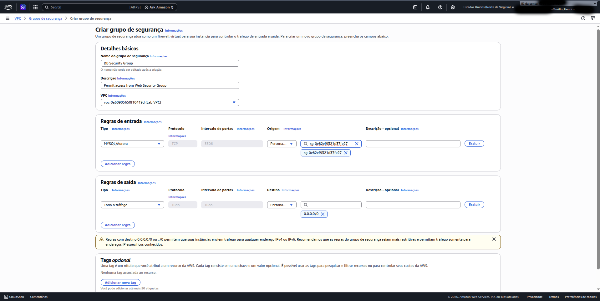
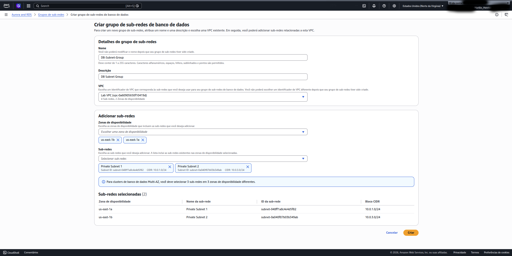
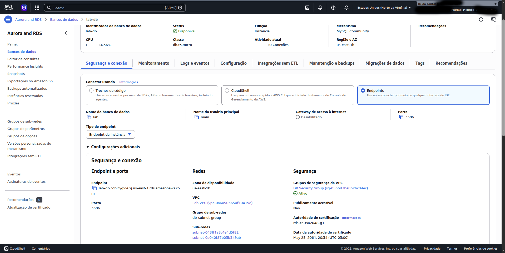
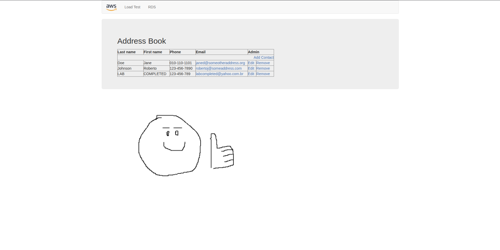

# README.md

# AWS RDS Multi-AZ Lab

Hands-on AWS lab focused on deploying a highly available MySQL database using Amazon RDS Multi-AZ, VPC networking, DB subnet groups, and Security Groups integration between EC2 and RDS.

---

## Architecture Overview

```text
User Browser
      │
      ▼
EC2 Web Application
(Web Security Group)
      │
      ▼
Amazon RDS MySQL (Primary)
(DB Security Group)
      │
Synchronous Replication
      ▼
Amazon RDS MySQL (Standby - Multi-AZ)
```

---

## Objectives

This lab demonstrates how to:

- Create Security Groups for controlled database access
- Configure DB Subnet Groups across multiple Availability Zones
- Deploy an Amazon RDS MySQL database
- Enable Multi-AZ high availability
- Connect a web application hosted on EC2 to RDS
- Understand secure communication between AWS services
- Test data persistence and database replication

---

# Technologies Used

- Amazon EC2
- Amazon RDS
- MySQL
- AWS VPC
- Security Groups
- DB Subnet Groups
- Multi-AZ Deployment
- AWS Management Console

---

# Lab Steps

---

## 1. Creating the DB Security Group

A dedicated Security Group was created to allow only the Web Security Group to communicate with the database through port `3306`.

### Configuration

| Setting | Value |
|---|---|
| Type | MySQL/Aurora |
| Port | 3306 |
| Source | Web Security Group |

### Screenshot



---

## 2. Creating the DB Subnet Group

A DB Subnet Group was configured using two subnets located in different Availability Zones to support Multi-AZ deployment.

### Selected Subnets

| Availability Zone | CIDR |
|---|---|
| us-east-1a | 10.0.1.0/24 |
| us-east-1b | 10.0.3.0/24 |

### Screenshot



---

## 3. Configuring the Amazon RDS Instance

An Amazon RDS MySQL database instance was deployed with Multi-AZ enabled for high availability.

### Main Configuration

| Setting | Value |
|---|---|
| Engine | MySQL |
| Deployment | Multi-AZ |
| Instance Type | db.t3.micro |
| Storage | 20 GB GP SSD |
| Database Name | lab |
| Username | main |

### Screenshots

.png)

.png)

.png)

.png)

.png)

---

## 4. Retrieving the RDS Endpoint

After deployment, the database endpoint was retrieved from the RDS Connectivity & Security section.

This endpoint allows the EC2 web application to communicate securely with the database.

### Screenshot



---

## 5. Connecting the Web Application to RDS

The provided EC2-hosted web application was configured to connect to the RDS database using:

- Endpoint
- Database name
- Username
- Password

After configuration, the application successfully persisted data inside the RDS database.

### Screenshot



---

# Security Concepts Learned

This lab demonstrates several important AWS security practices:

- Principle of least privilege
- Private database deployment
- Security Group-based access control
- Database isolation inside private subnets
- Multi-AZ high availability architecture
- Controlled EC2 ↔ RDS communication

---

# Multi-AZ Architecture

Amazon RDS Multi-AZ automatically creates:

- One Primary database instance
- One Standby replica in another Availability Zone

Benefits:

- Automatic failover
- High availability
- Synchronous replication
- Increased durability
- Production-grade resilience

---

# Key Takeaways

During this lab, the following concepts were practiced:

- AWS networking fundamentals
- VPC segmentation
- Database security
- Managed database services
- High availability architecture
- EC2 to RDS communication
- Multi-AZ replication
- Cloud infrastructure design

---

# Repository Structure

```text
aws-rds-multiaz-lab/
│
├── images/
├── README.md
└── security-analysis.md
```

---

# Tags

`aws` `amazon-rds` `mysql` `multi-az` `vpc` `security-groups` `ec2` `cloud-computing` `aws-labs`

---

# Badges

```markdown


```
