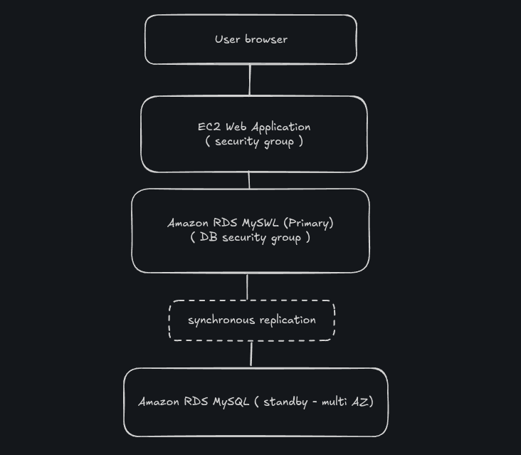

# Security Analysis — AWS RDS Multi-AZ Lab

## Overview

This document analyzes the security architecture and best practices implemented during the AWS RDS Multi-AZ lab.

The environment was designed to demonstrate secure communication between an EC2 web application and an Amazon RDS MySQL database while maintaining network isolation and controlled access.

---

# Architecture Security Model



---

# Security Controls Implemented

## 1. Security Group Isolation

A dedicated Security Group was created specifically for the RDS database.

### Rule Implemented

| Protocol | Port | Source |
|---|---|---|
| MySQL | 3306 | Web Security Group |

### Security Benefits

- Restricts database access to trusted EC2 instances only
- Prevents arbitrary inbound internet connections
- Reduces attack surface exposure
- Implements least privilege networking

---

# 2. Private Database Accessibility

The RDS database was configured as:

```text
Publicly Accessible: No
```

### Security Benefits

- Database cannot be reached directly from the internet
- Prevents public brute-force attacks
- Limits exposure of database services
- Forces access through authorized internal resources

---

# 3. Multi-AZ High Availability

The deployment used Amazon RDS Multi-AZ architecture.

### Security and Resilience Benefits

- Synchronous data replication
- Automatic failover support
- Improved durability
- Reduced downtime risk
- Increased infrastructure resilience

### Availability Zones Used

| AZ | Purpose |
|---|---|
| us-east-1a | Primary |
| us-east-1b | Standby |

---

# 4. DB Subnet Group Segmentation

The database was deployed inside dedicated subnets.

### Security Benefits

- Network segmentation
- Infrastructure isolation
- Controlled routing
- Better internal resource organization

---

# 5. Managed Database Security

Amazon RDS abstracts several infrastructure security responsibilities.

AWS handles:

- OS patching
- Storage replication
- Infrastructure maintenance
- Hardware redundancy
- Database failover orchestration

### Shared Responsibility Model

| AWS Responsibility | Customer Responsibility |
|---|---|
| Infrastructure security | Security Groups |
| Physical security | Credentials |
| Hardware redundancy | Database configuration |
| Managed replication | Access management |

---

# Potential Security Improvements

This lab intentionally disabled some production-grade features to speed up provisioning.

In real environments, the following should be enabled:

---

## Enable Automatic Backups

Disabled in the lab.

### Production Recommendation

Enable automated backups for:

- Disaster recovery
- Point-in-time recovery
- Data retention

---

## Enable Encryption

Disabled in the lab.

### Production Recommendation

Enable:

- Encryption at rest
- Encryption in transit
- AWS KMS integration

---

## Use Strong Credentials

Lab credentials were intentionally simple:

```text
Username: main
Password: lab-password
```

### Production Recommendation

- Strong password policies
- Secrets Manager integration
- IAM database authentication

---

## Enable Monitoring

Enhanced monitoring was disabled in the lab.

### Production Recommendation

Use:

- CloudWatch metrics
- Enhanced Monitoring
- Performance Insights
- Alerting systems

---

# Attack Surface Analysis

## Exposed Components

| Component | Exposure |
|---|---|
| EC2 Web Application | Public |
| RDS Database | Private |

---

## Protected Components

The database remains protected through:

- Security Groups
- Private subnet placement
- Internal VPC communication
- No public endpoint exposure

---

# Security Concepts Learned

This lab demonstrates practical implementation of:

- Network segmentation
- Least privilege access
- Secure service-to-service communication
- Database isolation
- High availability architecture
- Managed cloud security
- Internal VPC networking

---

# Final Considerations

This architecture resembles real-world cloud deployments where:

- Web applications remain publicly accessible
- Databases remain private
- Access is strictly controlled
- High availability is mandatory
- Infrastructure resilience is prioritized

The lab provides a strong introduction to secure cloud database architecture using AWS managed services.
